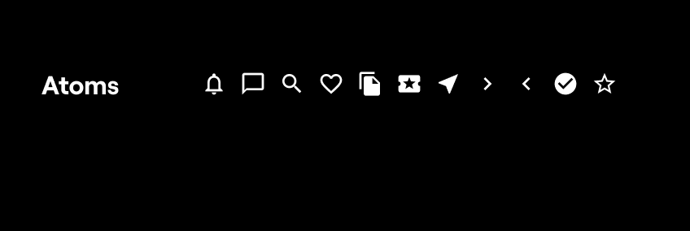

# D - Icon

# TP - Design & Storybook

## Installation :

Clone this repo

`npm install`

`npm run start`

`npm run storybook`

## Design



All icons have been imported as SVGs into the folder : `src/ui/atoms/assets/icons`
and are exported in the index file.

SVGs have been prettify thanks to **SVGOMG** : https://jakearchibald.github.io/svgomg/

## Developpement

Display the wanted icon thanks to an **unique** function :

```
const Icon = (props) => {
	const { name, color } = props;

	if (!assets[name]) {
		return null;
	}

	return <StyledDiv src={assets[name]} color={color} />;
};
```

The function work as in this example :

After importing the component into the file, put the wanted icon name :

```
<Icon name="choosedIconName" >
```

The color props is facultative (but do not work due to the svg's fill coloration, did not found how to manage the change...)
